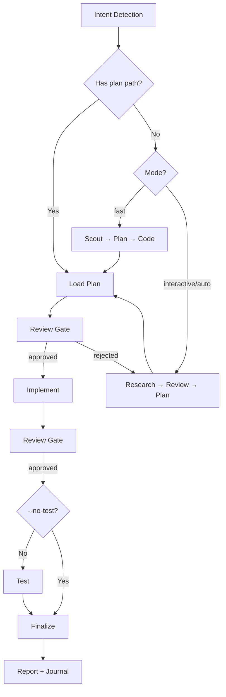

# Cook - Smart Feature Implementation

End-to-end implementation with automatic workflow detection.

**Principles:** YAGNI, KISS, DRY | Token efficiency | Concise reports

## Usage

```
/hs:cook <natural language task OR plan path>
```

**IMPORTANT:** If no flag is provided, the skill will use the `interactive` mode by default for the workflow.

**Optional flags to select the workflow mode:**

- `--interactive`: Full workflow with user input (**default**)
- `--fast`: Skip research, scout→plan→code
- `--parallel`: Multi-agent execution
- `--no-test`: Skip testing step
- `--auto`: Continue implementation and review gates without pausing; it does not authorize commits, pushes, external providers, destructive actions, or disclosure.

**Example:**

```
/hs:cook "Add user authentication to the app" --fast
/hs:cook path/to/plan.md --auto
```

<HARD-GATE>
Do NOT write implementation code until a plan exists and has been reviewed.
This applies regardless of task simplicity. "Simple" tasks are where unexamined assumptions waste the most time.
Exception: `--fast` mode skips research but still requires a plan step.
User override: If user explicitly says "just code it" or "skip planning", respect their instruction.
</HARD-GATE>

## Anti-Rationalization

| Thought                         | Reality                                                                   |
| ------------------------------- | ------------------------------------------------------------------------- |
| "This is too simple to plan"    | Simple tasks have hidden complexity. Plan takes 30 seconds.               |
| "I already know how to do this" | Knowing ≠ planning. Write it down.                                        |
| "Let me just start coding"      | Undisciplined action wastes tokens. Plan first.                           |
| "The user wants speed"          | Fastest path = plan → implement → done. Not: implement → debug → rewrite. |
| "I'll plan as I go"             | That's not planning, that's hoping.                                       |
| "Just this once"                | Every skip is "just this once." No exceptions.                            |

## Smart Intent Detection

| Input Pattern                     | Detected Mode | Behavior                           |
| --------------------------------- | ------------- | ---------------------------------- |
| Path to `plan.md` or `phase-*.md` | code          | Execute existing plan              |
| Contains "fast", "quick"          | fast          | Skip research, scout→plan→code     |
| Explicit `--auto` flag            | auto          | Continue implementation gates only |
| Lists 3+ features OR "parallel"   | parallel      | Multi-agent execution              |
| Contains "no test", "skip test"   | no-test       | Skip testing step                  |
| Default                           | interactive   | Full workflow with user input      |

See `references/intent-detection.md` for detection logic.

## Process Flow (Authoritative)



**This diagram is the authoritative workflow.** Prose sections below provide detail for each node. If prose conflicts with this flow, follow the diagram.

## Workflow Overview

```
[Intent Detection] → [Research?] → [Review] → [Plan] → [Review] → [Implement] → [Review] → [Test?] → [Review] → [Finalize]
```

**Default (non-auto):** Stops at `[Review]` gates for human approval before each major step.
**Auto mode (`--auto`):** Continues implementation and review gates across phases. Authority-changing actions remain separately opt-in.
At each required gate, ask the user and do not continue without the required answer. Delegate bounded specialist work when available; progress tracking is optional and never determines correctness or completion.

| Mode        | Research | Testing | Review Gates                   | Phase Progression      |
| ----------- | -------- | ------- | ------------------------------ | ---------------------- |
| interactive | ✓        | ✓       | **User approval at each step** | One at a time          |
| auto        | ✓        | ✓       | Auto if score≥9.5              | All at once (no stops) |
| fast        | ✗        | ✓       | **User approval at each step** | One at a time          |
| parallel    | Optional | ✓       | **User approval at each step** | Parallel groups        |
| no-test     | ✓        | ✗       | **User approval at each step** | One at a time          |
| code        | ✗        | ✓       | **User approval at each step** | Per plan               |

## Step Output Format

```
✓ Step [N]: [Brief status] - [Key metrics]
```

## Blocking Gates (Non-Auto Mode)

Human review required at these checkpoints (skipped with `--auto`):

- **Post-Research:** Review findings before planning
- **Post-Plan:** Approve plan before implementation
- **Post-Implementation:** Approve code before testing
- **Post-Testing:** Review test evidence against the approved requirements and design before finalizing

**Always enforced (all modes):**

- **Testing:** Use results as a feedback loop, not proof of correctness. Resolve unexpected failures, explain intentional exceptions, and verify relevant behavior against the approved requirements and design (unless no-test mode).
- **Code Review:** User approval OR auto-approve (score≥9.5, 0 critical)
- **Finalize (MANDATORY - never skip):**
  1. `project-manager` subagent → run full plan sync-back (all completed tasks/steps across all `phase-XX-*.md`, not only current phase), then update `plan.md` status/progress
  2. `docs-manager` subagent → update `./docs` if changes warrant
  3. When the current runtime supports progress tracking, mark work complete only after sync-back verification. Tracking is never completion evidence.
  4. Offer a focused commit only when the user explicitly requests one in the current conversation.
  5. Run `/hs:journal` to write a concise technical journal entry upon completion

## Required Subagents (MANDATORY)

| Phase    | Subagent                          | Requirement                                                                                                                   |
| -------- | --------------------------------- | ----------------------------------------------------------------------------------------------------------------------------- |
| Research | `researcher`                      | Optional in fast/code                                                                                                         |
| Scout    | `hs:scout`                        | Optional in code                                                                                                              |
| Plan     | `planner`                         | Optional in code                                                                                                              |
| UI Work  | `ui-ux-designer`                  | If frontend work                                                                                                              |
| Testing  | `tester`, `debugger`              | **MUST** delegate when available; otherwise perform the same scope sequentially                                               |
| Review   | `code-reviewer`                   | **MUST** delegate when available; otherwise perform the same scope sequentially                                               |
| Finalize | `project-manager`, `docs-manager` | **MUST** run applicable sync and documentation handoff; `git-manager` is optional and requires explicit commit authorization. |

**CRITICAL ENFORCEMENT:**

- Steps 4, 5, 6 **MUST** delegate bounded specialist work when delegation is available; otherwise perform the same bounded work sequentially and report the fallback.
- Use the available delegation facility for bounded specialist work. If delegation is unavailable, perform the same scoped work sequentially and record that fallback.

## References

- `references/intent-detection.md` - Detection rules and routing logic
- `references/workflow-steps.md` - Detailed step definitions, decision-recording, and code-quality guidance
- `references/review-cycle.md` - Interactive and auto review processes
- `references/subagent-patterns.md` - Subagent invocation patterns
