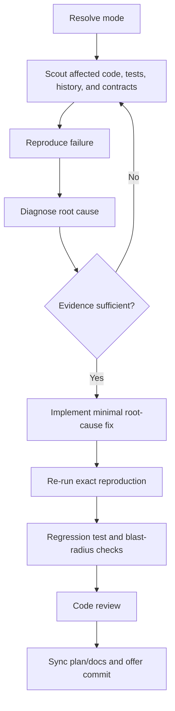

# Fix

Repair failures through a reproducible evidence chain: scout, reproduce, diagnose, fix the root cause, verify, prevent recurrence, and finalize.

**Principles:** YAGNI, KISS, DRY | evidence before claims | minimal safe changes

## Usage

```text
/hs:fix Login submit returns 500 locally
/hs:fix --review Payment webhook double-charges paid orders
/hs:fix --fast npm run build fails after the latest merge
```

## Modes

Default to `--auto` for low-to-moderate-risk fixes with a clear reproduction. Use `--review` for production, billing, authentication, data loss, migration, or public-contract risk. Use `--fast` only for isolated lint, type, or single-file failures. Use `--parallel` only for two or more independent failures with separate touchpoints.

Read [mode-selection.md](references/mode-selection.md) when the requested mode is unclear or risk needs classification.

## Hard Gates

<HARD-GATE>
Do not edit production code before scout and diagnosis establish an evidence-backed root cause. Do not close the task until the original reproduction has been rerun and relevant regression checks pass.
</HARD-GATE>

The root-cause record must include the symptom, exact reproduction, expected and actual behavior, causal file and line where available, why the failure occurs now, and blast radius. Never replace this with “probably” or a symptom patch.

## Process Flow (Authoritative)



If prose conflicts with the diagram, follow the diagram.

## Workflow

1. **Resolve and scout.** Determine the risk mode. Use `hs:scout` to map the affected files, dependencies, tests, recent history, established patterns, and relevant contracts. Summarize concrete findings before asking clarifying questions.
2. **Reproduce and diagnose.** Capture the pre-fix failure with the exact command or request path. Use the `debugger` agent for non-obvious causes. Read [diagnosis.md](references/diagnosis.md) to form and test the RCA.
3. **Repair the cause.** Use the `fullstack-developer` agent for a scoped implementation when appropriate. Change the smallest surface that fixes the identified cause and preserve unrelated behavior.
4. **Verify and prevent.** Rerun the original reproduction first, then add or update a regression test where practical and run blast-radius checks. Use the `tester` agent and read [verification.md](references/verification.md).
5. **Review and finalize.** Run `hs:code-review` or consult `code-reviewer`. If the repair is part of a plan, synchronize verified phase status through `project-manager`; consult `docs-manager` for affected guidance. Offer a commit through `git-manager` only with explicit user authorization, then run `hs:journal`.

## Mode Boundaries

- **`--auto`:** Continue through low-risk gates after evidence is collected; still stop for material risk, missing reproduction, destructive remediation, or commit authorization.
- **`--review`:** Present the scout/RCA, proposed fix, and verification evidence for user approval before each transition.
- **`--fast`:** Reduce research depth, but never skip reproduction, RCA, re-running the original failure, or targeted verification.
- **`--parallel`:** Assign one independent failure per lane with explicit file ownership. Reconcile shared dependencies and run combined verification before finalizing.

## Completion Proof

Do not claim a fix is complete without fresh evidence that:

1. The exact pre-fix reproduction no longer fails.
2. A regression test fails before and passes after where feasible, or the reason it cannot be added is explicit.
3. Relevant contracts, dependent paths, lint, types, build, and tests are clean in proportion to risk.
4. Recurrence prevention is addressed through a test, guard, validation, observability, or documented follow-up.
5. Plan status and documentation are synchronized when affected.

## Handoff

Report the reproduction, root cause with evidence, files changed, verification commands and results, prevention measure, remaining risk, and any follow-up. Keep the report concise and distinguish observed facts from inference.
